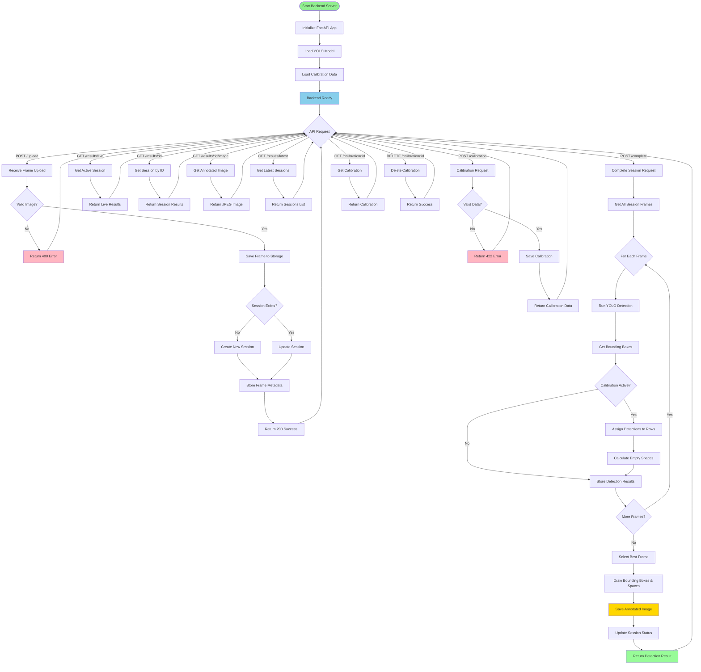

# Backend Flow - Parkit System

## Backend Architecture & Processing Flow

## Key Components

### 1. YOLO Detection Engine
- Model: YOLOv8 (motorcycle detection)
- Input: Image frames
- Output: Bounding boxes with confidence scores

### 2. Calibration System
- Stores parking row positions
- Assigns detections to rows
- Calculates empty spaces
- Determines motorcycle fit

### 3. Session Management
- Tracks upload sessions
- Stores frame metadata
- Manages detection results
- Handles session lifecycle

### 4. Storage Layer
- Frame images (uploads/)
- Annotated results (results/)
- Session data (in-memory/database)
- Calibration data (JSON files)

## Processing Pipeline

1. **Frame Upload** → Validate → Store → Track Session
2. **Detection** → YOLO → Bounding Boxes → Confidence Filtering
3. **Calibration** → Row Assignment → Space Calculation → Occupancy Rate
4. **Annotation** → Draw Boxes → Draw Spaces → Save Image
5. **Results** → Best Frame Selection → API Response

