# Frontend Flow - Parkit System

## Frontend User Interface & Interaction Flow

```mermaid
flowchart TD
    Start([User Opens App]) --> LoadApp[Load Frontend App]
    LoadApp --> InitRouter[Initialize Router]
    InitRouter --> ShowHome[Show Home Page]
    
    ShowHome --> UserAction{User Action}
    
    %% Upload Page Flow
    UserAction -->|Navigate to Upload| UploadPage[Upload Page]
    UploadPage --> CameraOption{Choose Option}
    
    %% Camera Stream Option
    CameraOption -->|Camera Stream| EnterURL[Enter Camera URL]
    EnterURL --> ConnectCam[Click Connect]
    ConnectCam --> ValidateURL{Valid URL?}
    ValidateURL -->|No| ShowError1[Show Error]
    ValidateURL -->|Yes| LoadStream[Load Camera Stream]
    LoadStream --> ShowPreview[Show Live Preview Portrait 90°]
    ShowPreview --> UserCamAction{User Action}
    
    UserCamAction -->|Hover| ShowCoords[Show Coordinates X,Y]
    UserCamAction -->|Click| DrawMarker[Draw Green Marker]
    UserCamAction -->|Capture| CaptureFrame[Capture Frame]
    
    CaptureFrame --> RotateImage[Rotate 90° to Portrait]
    RotateImage --> AddToList[Add to Upload List]
    AddToList --> UserCamAction
    
    %% Manual Upload Option
    CameraOption -->|Manual Upload| SelectFiles[Click Select Images]
    SelectFiles --> BrowseFiles[Browse File System]
    BrowseFiles --> ValidateFiles{Valid Files?}
    ValidateFiles -->|No| ShowError2[Show Error]
    ValidateFiles -->|Yes| ShowPreviews[Show Image Previews]
    
    %% Session Configuration
    ShowPreviews --> EnterSession[Enter Session ID]
    AddToList --> EnterSession
    EnterSession --> EnterCamera[Enter Camera ID Optional]
    EnterCamera --> ClickUpload[Click Upload Frames]
    
    %% Upload Process
    ClickUpload --> UploadLoop{For Each File}
    UploadLoop --> SendFrame[POST /upload]
    SendFrame --> ShowProgress[Show Upload Progress]
    ShowProgress --> CheckResponse{Success?}
    CheckResponse -->|No| ShowError3[Show Upload Error]
    CheckResponse -->|Yes| NextFile{More Files?}
    NextFile -->|Yes| UploadLoop
    NextFile -->|No| AllUploaded[All Uploaded]
    
    AllUploaded --> ShowComplete[Show Complete Button]
    ShowComplete --> ClickComplete[Click Complete Session]
    ClickComplete --> SendComplete[POST /complete]
    SendComplete --> ShowLoading[Show Loading]
    ShowLoading --> WaitProcess[Wait for Processing]
    WaitProcess --> ProcessDone{Success?}
    ProcessDone -->|No| ShowError4[Show Error]
    ProcessDone -->|Yes| RedirectResults[Redirect to Results]
    
    %% Results Page Flow
    UserAction -->|Navigate to Results| ResultsPage[Results Page]
    RedirectResults --> ResultsPage
    ResultsPage --> FetchLive[GET /results/live]
    FetchLive --> CheckLive{Data Available?}
    CheckLive -->|No| ShowNoData[Show No Data Message]
    CheckLive -->|Yes| DisplayResults[Display Detection Results]
    
    DisplayResults --> ShowImage[Show Annotated Image]
    ShowImage --> ShowStats[Show Statistics]
    ShowStats --> ShowDetails[Show Detection Details]
    
    ShowDetails --> ResultAction{User Action}
    ResultAction -->|View History| FetchLatest[GET /results/latest]
    ResultAction -->|Select Session| FetchSession[GET /results/:id]
    ResultAction -->|Refresh| FetchLive
    
    FetchLatest --> ShowList[Show Sessions List]
    ShowList --> ResultAction
    
    FetchSession --> DisplayResults
    
    %% Calibration Page Flow
    UserAction -->|Navigate to Calibration| CalibPage[Calibration Page]
    CalibPage --> FetchCalib[GET /calibration/:id]
    FetchCalib --> CheckCalib{Calibration Exists?}
    CheckCalib -->|No| ShowCalibForm[Show Calibration Form]
    CheckCalib -->|Yes| ShowCalibData[Show Calibration Data]
    
    ShowCalibForm --> UploadCalibImage[Upload Reference Image]
    UploadCalibImage --> ShowCalibPreview[Show Image Preview]
    ShowCalibPreview --> ClickRows[Click to Mark Rows]
    ClickRows --> DrawRowLines[Draw Row Lines]
    DrawRowLines --> EnterRowData[Enter Row Details]
    EnterRowData --> SaveCalib[POST /calibration]
    SaveCalib --> CalibSuccess{Success?}
    CalibSuccess -->|No| ShowError5[Show Error]
    CalibSuccess -->|Yes| ShowCalibData
    
    ShowCalibData --> CalibAction{User Action}
    CalibAction -->|Edit| ShowCalibForm
    CalibAction -->|Delete| DeleteCalib[DELETE /calibration/:id]
    CalibAction -->|Back| UserAction
    
    DeleteCalib --> CalibPage
    
    %% Error Handling
    ShowError1 --> UserAction
    ShowError2 --> UserAction
    ShowError3 --> UserAction
    ShowError4 --> UserAction
    ShowError5 --> UserAction
    ShowNoData --> UserAction
    
    style Start fill:#90EE90
    style ShowHome fill:#87CEEB
    style DisplayResults fill:#98FB98
    style ShowError1 fill:#FFB6C1
    style ShowError2 fill:#FFB6C1
    style ShowError3 fill:#FFB6C1
    style ShowError4 fill:#FFB6C1
    style ShowError5 fill:#FFB6C1
    style RedirectResults fill:#FFD700
```

## Key Features

### 1. Camera Integration
- Live camera stream support (DroidCam/IP Camera)
- Portrait mode (90° rotation)
- Real-time coordinate display
- Click to mark coordinates
- Frame capture with rotation

### 2. Upload Management
- Multiple file selection
- Drag & drop support
- Image preview
- Upload progress tracking
- Session management

### 3. Results Visualization
- Annotated image display
- Detection statistics
- Empty space indicators
- Occupancy rate
- Session history

### 4. Calibration Interface
- Visual row marking
- Coordinate input
- Reference image upload
- Calibration management

## User Interactions

1. **Upload Flow**: Camera/Files → Session Config → Upload → Complete → Results
2. **View Flow**: Results Page → Live/History → Details
3. **Calibration Flow**: Upload Image → Mark Rows → Save → Activate

## UI Components

- **Router**: SPA navigation
- **API Client**: Backend communication
- **UI Manager**: Notifications, loading states
- **Pages**: Upload, Results, Calibration, Home
