# System Communication Flow - Parkit Complete System

## End-to-End System Architecture


## Complete User Journey Flow

```mermaid
sequenceDiagram
    participant U as 👤 User
    participant F as 🖥️ Frontend
    participant B as ⚙️ Backend
    participant Y as 🔬 YOLO
    participant S as 💾 Storage
    
    Note over U,S: 1. CALIBRATION SETUP (One-time)
    U->>F: Navigate to Calibration
    F->>B: GET /calibration/:camera_id
    B->>S: Load calibration data
    S-->>B: Calibration or null
    B-->>F: Return calibration
    
    alt No Calibration
        U->>F: Upload reference image
        U->>F: Click to mark parking rows
        U->>F: Enter row details
        F->>B: POST /calibration
        B->>S: Save calibration
        S-->>B: Success
        B-->>F: Calibration saved
        F-->>U: Show success
    end
    
    Note over U,S: 2. FRAME UPLOAD
    U->>F: Navigate to Upload
    
    alt Camera Stream
        U->>F: Enter camera URL
        F->>F: Connect to camera
        F-->>U: Show live preview (90° rotated)
        U->>F: Click capture frame
        F->>F: Rotate & prepare image
    else Manual Upload
        U->>F: Select image files
        F-->>U: Show previews
    end
    
    U->>F: Enter session ID
    U->>F: Enter camera ID (optional)
    U->>F: Click Upload
    
    loop For each frame
        F->>B: POST /upload (multipart/form-data)
        B->>S: Save frame image
        B->>S: Update session metadata
        S-->>B: Success
        B-->>F: 200 OK
        F-->>U: Update progress bar
    end
    
    Note over U,S: 3. DETECTION PROCESSING
    U->>F: Click Complete Session
    F->>B: POST /complete/:session_id
    B->>S: Load all session frames
    
    loop For each frame
        B->>Y: Run detection
        Y-->>B: Bounding boxes + confidence
        
        alt Calibration Active
            B->>B: Assign detections to rows
            B->>B: Calculate empty spaces
            B->>B: Calculate occupancy rate
        end
        
        B->>S: Store detection results
    end
    
    B->>B: Select best frame (max detections)
    B->>B: Draw annotations (boxes + spaces)
    B->>S: Save annotated image
    B->>S: Update session status
    S-->>B: Success
    B-->>F: Detection results
    F-->>U: Redirect to Results
    
    Note over U,S: 4. VIEW RESULTS
    U->>F: View Results Page
    F->>B: GET /results/live
    B->>S: Query active session
    S-->>B: Session data
    B-->>F: Detection results JSON
    
    F->>B: GET /results/:session_id/image
    B->>S: Load annotated image
    S-->>B: Image file
    B-->>F: JPEG image
    
    F-->>U: Display results
    F-->>U: Show statistics
    F-->>U: Show annotated image
    
    Note over U,S: 5. VIEW HISTORY
    U->>F: Click View History
    F->>B: GET /results/latest?limit=10
    B->>S: Query sessions
    S-->>B: Sessions list
    B-->>F: Sessions JSON
    F-->>U: Display history
    
    U->>F: Select specific session
    F->>B: GET /results/:session_id
    B->>S: Load session
    S-->>B: Session data
    B-->>F: Results JSON
    F-->>U: Display details
```



## Data Flow Summary

### 1. Upload Phase
```
User → Frontend → Backend → Storage
- Images uploaded via multipart/form-data
- Session tracking with unique ID
- Frame metadata stored
```

### 2. Processing Phase
```
Backend → YOLO → Calibration → Storage
- YOLO detects motorcycles
- Calibration assigns to rows
- Empty spaces calculated
- Results annotated and saved
```

### 3. Results Phase
```
Frontend → Backend → Storage → Frontend → User
- JSON data for statistics
- JPEG image for visualization
- Real-time updates
```

## API Endpoints Summary

| Method | Endpoint | Purpose |
|--------|----------|---------|
| POST | `/upload` | Upload frame images |
| POST | `/complete/:session_id` | Process detection |
| GET | `/results/live` | Get active session |
| GET | `/results/:session_id` | Get specific session |
| GET | `/results/:session_id/image` | Get annotated image |
| GET | `/results/latest` | Get sessions list |
| POST | `/calibration` | Save calibration |
| GET | `/calibration/:camera_id` | Get calibration |
| DELETE | `/calibration/:camera_id` | Delete calibration |

## Key Technologies

### Frontend
- Vanilla JavaScript (SPA)
- HTML5 Canvas (coordinate marking)
- Fetch API (HTTP requests)
- CSS3 (responsive design)

### Backend
- FastAPI (Python web framework)
- YOLOv8 (object detection)
- OpenCV (image processing)
- Pillow (image manipulation)

### Storage
- File system (images)
- JSON files (calibration)
- In-memory (session data)

## System Features

1. **Real-time Detection**: Live camera integration
2. **Calibration System**: Parking row configuration
3. **Empty Space Detection**: Available parking calculation
4. **Occupancy Tracking**: Parking utilization metrics
5. **Session Management**: Multi-session support
6. **History Tracking**: Past detection results
7. **Responsive UI**: Mobile-friendly interface
8. **Error Handling**: Comprehensive error management

## Performance Considerations

- **Image Processing**: Async processing for multiple frames
- **Caching**: Result images cached for quick access
- **Pagination**: Latest results with limit/skip
- **Compression**: JPEG compression for storage efficiency
- **CORS**: Cross-origin support for camera streams
